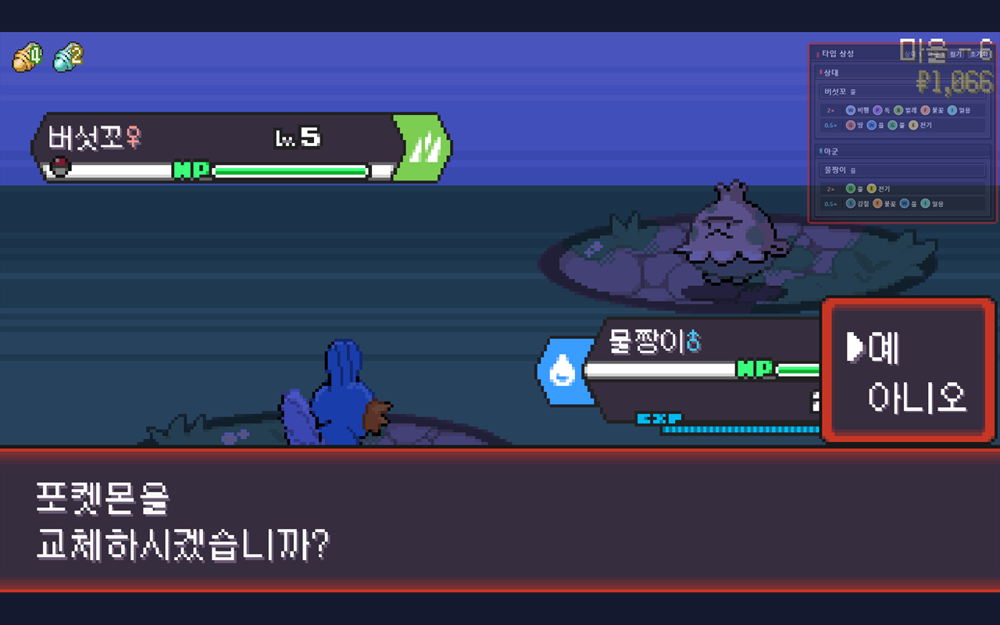

# TypeRogue

[English](README.md) | 한국어

[](https://chromewebstore.google.com/detail/flgokcgmagjelhpoadobjoddddopobdm)
[](https://addons.mozilla.org/ko/firefox/addon/typerogue/)

PokeRogue 전투 화면에서 아군과 상대 포켓몬의 방어 타입 상성을 바로 보여 주는 Chrome 및 Firefox 브라우저 확장입니다.


## 기능

- 전투 중인 아군·상대 포켓몬과 현재 타입을 자동으로 감지합니다.
- 공격 타입별 방어 배율을 `4×`, `2×`, `0.5×`, `0.25×`, `0×`로 나눠 표시합니다. 중립인 `1×`는 표시하지 않습니다.
- 싱글·더블 배틀과 융합 포켓몬을 지원합니다.
- 자동 감지에 실패하면 한국어 또는 영어 이름으로 포켓몬과 폼을 직접 고를 수 있습니다.
- 패널 위치와 접힘 상태를 브라우저 로컬 저장소에 기억합니다.
- 게임 서버나 외부 서버로 데이터를 보내지 않습니다.

## 설치

TypeRogue는 Chrome과 Firefox에서 사용할 수 있습니다. Firefox는 142 이상이 필요합니다.

### Chrome 웹 스토어에서 설치 (Chrome 권장)

1. Chrome에서 [Chrome 웹 스토어의 TypeRogue 페이지](https://chromewebstore.google.com/detail/flgokcgmagjelhpoadobjoddddopobdm)에 접속합니다.
2. **Chrome에 추가**를 누르고 설치 확인 창에서 승인합니다.

### Mozilla Add-ons에서 설치 (Firefox 권장)

1. Firefox에서 [Mozilla Add-ons의 TypeRogue 페이지](https://addons.mozilla.org/ko/firefox/addon/typerogue/)에 접속합니다.
2. **Firefox에 추가**를 누르고 설치 확인 창에서 승인합니다.

### 배포 패키지에서 임시 설치

1. 배포된 `.zip` 파일의 압축을 풉니다.
2. Firefox에서 `about:debugging#/runtime/this-firefox`를 엽니다.
3. **임시 부가 기능 로드**를 누릅니다.
4. 압축을 푼 폴더의 `manifest.json`을 선택합니다.

임시로 로드한 확장은 Firefox를 종료하면 제거됩니다.

### 소스에서 임시 로드

```powershell
npm.cmd test
npm.cmd run build
```

그다음 `about:debugging#/runtime/this-firefox`에서 `dist/firefox/manifest.json`을 선택합니다.

### Chrome 개발용 설치

```powershell
npm.cmd run build:chrome
```

Chrome에서 `chrome://extensions`를 열고 **개발자 모드**를 켠 다음 **압축해제된 확장 프로그램을 로드합니다**를 눌러 `dist/chrome`을 선택합니다.

## 사용법

PokeRogue에서 전투를 시작하면 화면 오른쪽 위에 타입 상성 패널이 나타납니다.



- 이동: 패널 제목 부분을 마우스로 끕니다.
- 접기·펼치기: 제목 줄의 **접기** 또는 **펼치기**를 누릅니다.
- 위치 복원: **초기화**를 누르면 기본 위치와 펼친 상태로 돌아갑니다.
- 수동 검색: 자동 감지 실패 메시지 아래에서 **상대 수동 선택** 또는 **아군 수동 선택**을 누르고, 한국어·영어 이름을 입력한 뒤 폼을 고릅니다.

## MVP 범위

현재 버전은 방어 타입 상성만 다룹니다. 다음 기능은 지원하지 않습니다.

- 보유 기술과 기술별 공격 상성 계산
- 특성, 기술, 테라스탈 등으로 생기는 일시적 타입 변화
- 자동 플레이나 게임 입력 조작
- 색상만으로 타입을 구분하는 표시
- 중립 방어 상성 `1×` 표시

수동 검색 목록은 대표 포켓몬과 일부 지역 폼·메가진화·원시회귀 폼만 포함합니다.

## 알려진 제한

자동 감지는 PokeRogue가 실행 중인 Phaser 장면의 공개 상태를 읽습니다. 전투 전환 중에는 잠시 비어 보일 수 있으며, PokeRogue 업데이트로 내부 구조가 바뀌면 자동 감지가 실패할 수 있습니다. 이 경우 수동 검색을 사용할 수 있지만, 새 폼이 목록에 없을 수 있습니다.

TypeRogue는 PokeRogue의 게임 코드나 입력을 변경하지 않습니다. 문제가 생기면 확장을 비활성화하고 PokeRogue가 정상 동작하는지 먼저 확인해 주세요.

## 개인정보

계정 정보, 게임 진행 정보, 검색어 또는 이용 기록을 수집하거나 전송하지 않습니다. 패널 위치와 접힘 상태만 `browser.storage.local`에 저장합니다. 자세한 내용은 [개인정보 안내](PRIVACY.ko.md)를 참고하세요.

## 라이선스와 고지

TypeRogue는 비공식 팬 도구이며 PokeRogue 또는 Pokémon 관계사와 제휴하지 않습니다. 프로젝트에 Pokémon 이미지나 공식 타입 아이콘을 포함하지 않습니다. 데이터와 아이콘 출처는 [라이선스 고지](THIRD_PARTY_NOTICES.md)에 정리했습니다.

TypeRogue 소스 코드는 [Mozilla Public License 2.0](LICENSE)으로 배포합니다. Copyright 2026 New Potato.

## 개발

```powershell
npm.cmd test
npm.cmd run build
npm.cmd run package
npm.cmd run amo:check
npm.cmd run cws:check
```

`build`는 `dist/firefox/`와 `dist/chrome/`을 만들고, `package`는 `web-ext-artifacts/` 아래에 브라우저별 제출용 ZIP을 만듭니다.
`amo:check`는 원격 코드나 미확정 배포자 정보가 남아 있으면 AMO 제출을 차단합니다.
`cws:check`는 Chrome 웹 스토어 패키징 전에 Chrome manifest, 권한, 개인정보 고지와 런타임 코드를 검사합니다.
